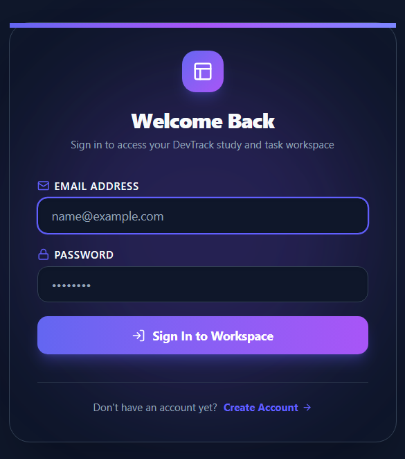
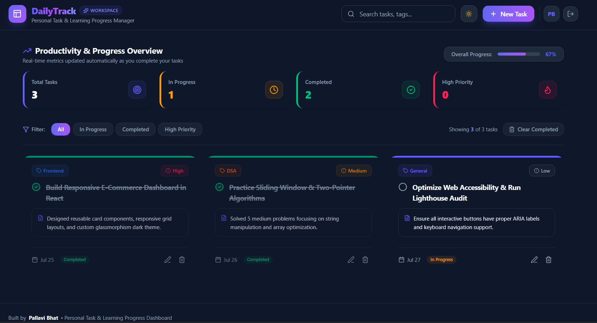
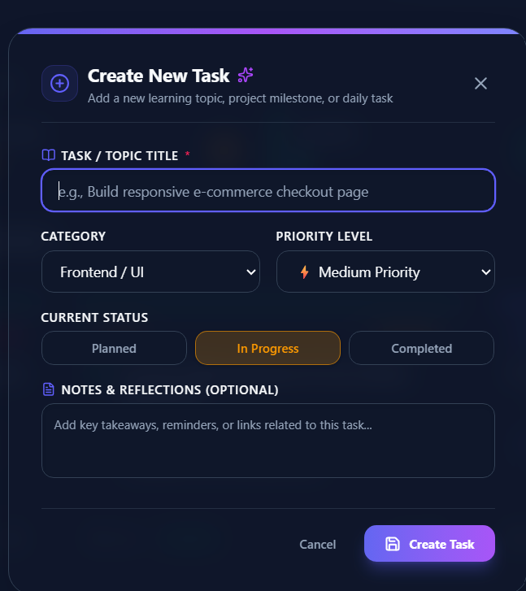

# 📋 DailyTrack

A productivity and task management application built with **React** and **Redux Toolkit** that helps users organize and manage their daily tasks efficiently.

## 🚀 Live Demo
🌐 https://dailytrack-wine.vercel.app

## 📖 Documentation
Detailed project documentation is available on Notion:

👉 https://app.notion.com/p/redux-3aac97f7609680cfaa60d78b22715988?source=copy_link

## ✨ Features

- Add new tasks
- Edit existing tasks
- Delete tasks
- Mark tasks as completed
- Global state management using Redux Toolkit
- Responsive UI
- Clean and reusable components

## 🛠️ Tech Stack

- React
- Redux Toolkit
- JavaScript
- Tailwind CSS
- Vite

## 📸 Screenshots

<h3>Login Page</h3>

  

<h3>Dashboard</h3>

  

<h3>Add Task</h3>

  

## 📚 What I Learned

- Redux Store (`configureStore`)
- `createSlice`
- `useSelector`
- `useDispatch`
- Global State Management
- Redux Data Flow
- CRUD Operations using Redux Toolkit

## 👩‍💻 Author

**Pallavi S Bhat**

GitHub: https://github.com/Pallavi-SBhat